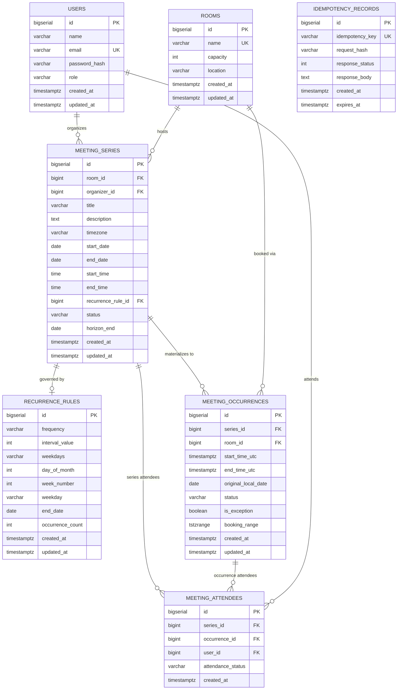

# Meeting Room Booking — Production Backend

A production-quality **Meeting Room Booking** Spring Boot 3.x backend with full recurring meeting support, strict timezone/DST correctness, PostgreSQL GiST exclusion constraints, Redis caching, rolling horizon expansion, and transactional conflict detection.

---

## Table of Contents

1. [Project Overview](#project-overview)
2. [Architecture](#architecture)
3. [Technology Stack](#technology-stack)
4. [Database Schema & ER Diagram](#database-schema--er-diagram)
5. [Recurrence Engine](#recurrence-engine)
6. [Timezone & DST Handling](#timezone--dst-handling)
7. [Conflict Detection](#conflict-detection)
8. [PostgreSQL Exclusion Constraint](#postgresql-exclusion-constraint)
9. [Rolling 12-Month Horizon](#rolling-12-month-horizon)
10. [Editing Recurring Meetings](#editing-recurring-meetings)
11. [Caching Architecture](#caching-architecture)
12. [Authentication & Authorization](#authentication--authorization)
13. [Idempotency](#idempotency)
14. [Scheduler](#scheduler)
15. [Failure Handling](#failure-handling)
16. [Transaction Strategy](#transaction-strategy)
17. [Monitoring](#monitoring)
18. [Docker Setup](#docker-setup)
19. [Environment Variables](#environment-variables)
20. [API Documentation](#api-documentation)
21. [Example API Calls](#example-api-calls)
22. [Complexity Analysis](#complexity-analysis)
23. [Scalability & Future Improvements](#scalability--future-improvements)
24. [Trade-offs](#trade-offs)
25. [Testing](#testing)

---

## Project Overview

This backend implements a complete **Meeting Room Booking System** with:

- **One-time** and **recurring** meeting booking
- Recurrence types: **Daily**, **Weekly** (multi-day, N-week intervals), **Monthly** (fixed day and Nth weekday)
- **Rolling 12-month horizon** — only materializes near-future occurrences
- **DST-safe** timezone handling with explicit gap/overlap policies
- **PostgreSQL GiST exclusion constraints** for concurrency-safe double-booking prevention
- **JWT authentication**, ROLE_USER / ROLE_ADMIN authorization
- **Redis caching** with resilient fallback to PostgreSQL
- **Idempotency** via `Idempotency-Key` header
- **Swagger / OpenAPI 3** documentation
- **Docker Compose** deployment

---

## Architecture

```
┌─────────────────────────────────────────────────────┐
│                    REST Controllers                  │
│   AuthController  RoomController  MeetingController  │
└──────────────────────┬──────────────────────────────┘
                       │
┌──────────────────────▼──────────────────────────────┐
│                    Service Layer                     │
│  AuthService  RoomService  MeetingService            │
└───┬─────────┬──────────────────────┬────────────────┘
    │         │                      │
    ▼         ▼                      ▼
┌───────┐ ┌────────────┐  ┌─────────────────────────┐
│ Redis │ │ PostgreSQL │  │   Recurrence Engine       │
│ Cache │ │            │  │  ┌───────────────────┐   │
│       │ │ Users      │  │  │ RecurrenceService  │   │
│ rooms │ │ Rooms      │  │  │ DailyGenerator     │   │
│ avail │ │ Series     │  │  │ WeeklyGenerator    │   │
│ cal   │ │ Occurrences│  │  │ MonthlyGenerator   │   │
└───────┘ │ Attendees  │  │  │ TimezoneService    │   │
          └────────────┘  │  └───────────────────┘   │
                          └─────────────────────────┘

Background Maintenance (Spring Scheduler):
  - RollingHorizonExpansionJob  (daily at 02:00)
  - DataRetentionJob            (monthly on 1st at 03:00)
```

### Core Domain Model

```
User
 └── MeetingSeries (1..n)
       ├── RecurrenceRule        (HOW it repeats)
       ├── MeetingOccurrence[]   (WHAT actually reserves the room)
       │     └── MeetingAttendee[]
       └── MeetingAttendee[]     (series-level attendees)
```

**Key separation**: `MeetingSeries` = logical recurring concept; `MeetingOccurrence` = concrete room reservation with UTC timestamps.

---

## Technology Stack

| Category | Technology |
|---|---|
| Language | Java 17 |
| Framework | Spring Boot 3.3.4 |
| Persistence | Spring Data JPA + Hibernate |
| Database | PostgreSQL 16 |
| Migrations | Flyway |
| Cache | Redis 7 |
| Security | Spring Security 6 + JWT (jjwt 0.12.6) |
| Validation | Hibernate Validator / Bean Validation 3 |
| Monitoring | Spring Boot Actuator + Micrometer + Prometheus |
| Documentation | SpringDoc OpenAPI 2.6.0 / Swagger UI |
| Utilities | Lombok |
| Container | Docker + Docker Compose |
| Testing | JUnit 5 + Mockito + Testcontainers |

---

## Database Schema & ER Diagram



### Attendee Modeling Decision

Attendees are stored at the **series level** by default (for recurring meetings), allowing efficient lookup. For exception occurrences (edited single instances), attendees can also be attached at the **occurrence level**. The schema supports both via nullable FKs with a check constraint ensuring at least one reference is set.

---

## Recurrence Engine

### Strategy Pattern

```
RecurrenceGenerator (interface)
  ├── DailyRecurrenceGenerator
  │     └── every N days
  ├── WeeklyRecurrenceGenerator
  │     └── every N weeks on selected Set<DayOfWeek>
  └── MonthlyRecurrenceGenerator
        ├── Fixed day (e.g. 15th)
        │     Policy: clamp to last valid day if month is shorter (31st → April 30th, Feb 28/29)
        └── Nth weekday (e.g. 2nd Wednesday, last Friday = weekNumber = -1)
              Policy: if 5th occurrence spills into next month, use last matching weekday in month
```

**Factory**: `RecurrenceService` uses Spring DI to auto-discover all `RecurrenceGenerator` beans and builds a `Map<RecurrenceFrequency, RecurrenceGenerator>` for O(1) dispatch.

---

## Timezone & DST Handling

All occurrence timestamps are stored in **UTC** (`TIMESTAMPTZ`). The series stores the **IANA timezone** string.

```java
// Generation flow:
ZoneId zoneId = ZoneId.of("America/New_York");
LocalDateTime localDT = LocalDateTime.of(date, startTime);
List<ZoneOffset> validOffsets = zoneId.getRules().getValidOffsets(localDT);
```

### DST Spring-Forward (Gap)
When clocks jump forward (e.g. 2:00 AM → 3:00 AM EST→EDT), 2:30 AM does not exist.  
**Policy**: Reject with HTTP 422 `NONEXISTENT_LOCAL_TIME` error, explaining the timezone and nonexistent time.

### DST Fall-Back (Overlap)
When clocks fall back (e.g. 2:00 AM → 1:00 AM EDT→EST), 1:30 AM occurs twice.  
**Policy**: Use the **first/earlier offset** (Daylight Time = UTC-4) via `validOffsets.get(0)`.  
This is documented and deterministic — never silently creates wrong timestamps.

---

## Conflict Detection

Uses **half-open intervals** `[start, end)`:

```
Conflict condition: existingStart < newEnd AND existingEnd > newStart

10:00-11:00 and 11:00-12:00 → NO conflict (back-to-back)
10:00-11:00 and 10:30-11:30 → CONFLICT
```

### Application-Level (User-Friendly)
Performed before database write to produce informative error responses with conflicting occurrence IDs and dates.

### Batch Conflict Validation
For recurring meetings with M occurrences:
1. Generate all M occurrence proposals in memory
2. Sort them and detect self-overlap in O(M log M)
3. Send the proposals through one PostgreSQL `VALUES` CTE and join to confirmed room reservations with the half-open interval predicate
4. If any conflict: **rollback entire series creation** with detailed conflict list

This uses one conflict-check round trip rather than one query per occurrence. PostgreSQL performs overlap comparisons using the room/time indexes; the application retains O(M) proposal and result space.

---

## PostgreSQL Exclusion Constraint

The **final concurrency safety net** preventing two simultaneous transactions from booking the same room at overlapping times:

```sql
-- booking_range is a GENERATED STORED column:
booking_range tstzrange GENERATED ALWAYS AS
  (tstzrange(start_time_utc, end_time_utc, '[)')) STORED

-- GiST exclusion constraint:
CONSTRAINT no_overlapping_room_bookings EXCLUDE USING GIST (
    room_id WITH =,
    booking_range WITH &&
) WHERE (status = 'CONFIRMED')
```

Only `CONFIRMED` occurrences reserve a room. Scheduler conflict rows are retained as audit information but do not block later bookings.

**Why both application-level AND database-level?**
- Application-level: provides informative error messages with conflict details
- Database-level: atomic guarantee — if two transactions pass application checks simultaneously, only one commits; the other gets a PostgreSQL error `23P01` (exclusion_violation), translated to HTTP 409

The `tstzrange` uses `[)` (inclusive start, exclusive end) matching the half-open interval semantics.

---

## Rolling 12-Month Horizon

Active recurring series never materialize indefinitely. Only the next 12 months of occurrences are materialized:

```
series.horizonEnd = localToday + 12 months, capped at ruleEndDate when present
```

The `MaintenanceScheduler.expandRollingHorizons()` job runs **daily at 02:00 AM**:
1. Queries series where `horizon_end < now + 30 days`
2. Generates new occurrences from `currentHorizonEnd + 1 day` to `now + 12 months`
3. Validates conflicts — background conflicts mark occurrences as `CONFLICT` (doesn't abort job)
4. Inserts via `saveAll()` — uniqueness constraint `UNIQUE(series_id, start_time_utc)` ensures idempotency

**Distributed Locking**: Each series is expanded in its own transaction after `SELECT ... FOR UPDATE` locks that series row. This serializes concurrent instances for a series. A deployment may still add ShedLock to avoid redundant job scans.

---

## Editing Recurring Meetings

### THIS
- Updates only the selected occurrence
- Sets `is_exception = true`
- Re-validates room conflict for the modified slot only
- All other occurrences in series remain unchanged

### THIS_AND_FUTURE
1. Cancels all future occurrences in the old series (preserves history)
2. Truncates old series `end_date` to `splitDate - 1`
3. Creates a new series starting from `splitDate` with new parameters
4. Generates and validates all new occurrences before inserting

This ensures historical occurrences remain associated with the original series — **no historical data is corrupted**.

### WHOLE_SERIES
1. Updates series metadata (title, room, times)
2. Cancels all future confirmed occurrences (past ones preserved)
3. Regenerates future occurrences from today forward
4. Validates and inserts new occurrences

---

## Caching Architecture

| Cache Name | Key | TTL | Invalidation Trigger |
|---|---|---|---|
| `rooms` | all entries | 30 min | Room created/updated |
| `room` | `roomId` | 30 min | Room created/updated |
| `availability` | `roomId:from:to` | 5 min | Meeting create/edit/cancel, room creation, and horizon expansion |

### Resilient Fallback
If Redis is unavailable, the `CacheErrorHandler` logs a warning and falls through to PostgreSQL. The application **never fails** due to Redis unavailability — it degrades gracefully in performance only.

**PostgreSQL is always the source of truth.** Redis is only an optimization.

---

## Authentication & Authorization

- **Registration**: `POST /api/auth/register` → BCrypt hashed password stored
- **Login**: `POST /api/auth/login` → JWT issued (HMAC-SHA256)
- **All protected endpoints**: require `Authorization: Bearer <token>`

| Role | Permissions |
|---|---|
| `ROLE_USER` | Create/view/edit/cancel own meetings |
| `ROLE_ADMIN` | All USER permissions + manage rooms + manage any meeting |

Authorization is enforced via:
1. `SecurityConfig` at path level for room management
2. `@PreAuthorize` at controller method level
3. Service layer `verifyUserAuthorization()` checking organizer ownership

Self-registration always assigns `ROLE_USER`; any role submitted by a public client is ignored. Provision the first administrator through a controlled database operation after registration, for example: `UPDATE users SET role='ROLE_ADMIN' WHERE email='admin@example.com';` Run this only with a trusted database operator. Meeting reads and edits are restricted to the organizer and administrators. Normal calendar queries return the caller's own organized meetings.

---

## Idempotency

POST requests to `/api/meetings/**` support the `Idempotency-Key` header:

```http
POST /api/meetings
Idempotency-Key: 550e8400-e29b-41d4-a716-446655440000
Content-Type: application/json
```

The request body, method, path, and query are hashed with SHA-256. If the same key is sent again within the TTL (default 60 minutes), an identical request replays its original response. Reusing a key for a different request returns HTTP 409. The response-capturing filter scopes keys to the authenticated account and reserves each key in PostgreSQL before running the booking handler. Concurrent retries receive an in-progress response instead of creating a duplicate. Abandoned reservations expire after the configured TTL. Request bodies above 1 MiB are rejected before buffering.

Records are stored in `idempotency_records` table and cleaned up by the monthly retention job.

---

## Scheduler

Two jobs, single `MaintenanceScheduler` bean:

| Job | Cron | Purpose |
|---|---|---|
| `expandRollingHorizons` | `0 0 2 * * *` (daily 02:00) | Extends horizon for series approaching 30-day threshold |
| `cleanupOldOccurrences` | `0 0 3 1 * *` (monthly, 1st 03:00) | Deletes cancelled/completed occurrences older than retention period |

Both jobs are **idempotent** — safe to run multiple times without creating duplicates.

---

## Failure Handling

| Failure | Behavior |
|---|---|
| Redis down | Cache errors logged; falls through to PostgreSQL |
| PostgreSQL transaction failure | Transaction rolled back; error surfaced as HTTP 500 or 409 |
| Concurrent booking (race condition) | PostgreSQL exclusion constraint rejects second commit → HTTP 409 |
| Duplicate occurrence in scheduler | Uniqueness constraint silently skips; job continues |
| Scheduler restart | Next run re-queries series needing expansion; fully idempotent |
| Client retry (network timeout) | `Idempotency-Key` replays original response |
| DST gap | HTTP 422 `NONEXISTENT_LOCAL_TIME` with explanation |

---

## Transaction Strategy

Meeting creation uses a single transaction:

```
BEGIN TRANSACTION
  1. Validate room, user, timezone
  2. Create MeetingSeries entity
  3. Generate all occurrence proposals
  4. Batch validate conflicts (read-only check)
  5. Build MeetingOccurrence entities
  6. seriesRepository.save(series) → cascades to occurrences + attendees
COMMIT  (or ROLLBACK if any step fails)
```

The PostgreSQL exclusion constraint provides the **second line of defence** for concurrent requests that pass through step 4 simultaneously.

---

## Monitoring

### Actuator Endpoints
- `GET /actuator/health` — application health
- `GET /actuator/metrics` — all Micrometer metrics
- `GET /actuator/prometheus` — Prometheus scrape endpoint

### Custom Metrics
| Metric | Type | Description |
|---|---|---|
| `booking.requests.total` | Counter | Total booking requests |
| `booking.conflicts.total` | Counter | Room conflict rejections |
| `booking.failures.total` | Counter | Booking failures |
| `booking.latency` | Timer | Meeting creation latency |
| `recurrence.generation.duration` | Timer | Recurrence expansion time |
| `scheduler.horizon.expansions` | Counter | Successful horizon expansions |
| `scheduler.horizon.failures` | Counter | Horizon expansion failures |
| `scheduler.retention.cleanups` | Counter | Occurrences cleaned up |

---

## Docker Setup

```bash
# Copy .env.example to .env; replace the database, Redis, and JWT secret placeholders.
# JWT_SECRET must be at least 32 bytes. Keep .env out of source control.
cp .env.example .env
# Build and start all services
docker compose up --build

# Start in background
docker compose up --build -d

# Tear down with volumes
docker compose down -v
```

Services:
- **App**: http://localhost:8080
- **Swagger UI**: http://localhost:8080/swagger-ui.html
- **Actuator**: http://localhost:8080/actuator/health
- **PostgreSQL**: localhost:5432
- **Redis**: localhost:6379

---

## Environment Variables

| Variable | Default | Description |
|---|---|---|
| `SERVER_PORT` | `8080` | HTTP server port |
| `DATABASE_URL` | `jdbc:postgresql://localhost:5432/meeting_booking` | JDBC URL |
| `DATABASE_USERNAME` | `postgres` | DB username |
| `DATABASE_PASSWORD` | required | DB password |
| `REDIS_HOST` | `localhost` | Redis host |
| `REDIS_PORT` | `6379` | Redis port |
| `REDIS_PASSWORD` | required in Docker Compose | Redis password |
| `JWT_SECRET` | required | JWT HMAC signing secret (at least 32 bytes) |

---

## API Documentation

Full Swagger UI: `http://localhost:8080/swagger-ui.html`

### Auth Endpoints
| Method | Path | Auth | Description |
|---|---|---|---|
| POST | `/api/auth/register` | None | Register new user |
| POST | `/api/auth/login` | None | Login and get JWT |

### Room Endpoints
| Method | Path | Auth | Description |
|---|---|---|---|
| POST | `/api/rooms` | ADMIN | Create room |
| GET | `/api/rooms` | USER/ADMIN | List all rooms |
| GET | `/api/rooms/{id}` | USER/ADMIN | Get room by ID |
| GET | `/api/rooms/{id}/availability?from=...&to=...` | USER/ADMIN | Check an exact UTC interval for room conflicts |

### Meeting Endpoints
| Method | Path | Auth | Description |
|---|---|---|---|
| POST | `/api/meetings` | USER | Create one-time or recurring meeting |
| POST | `/api/meetings/recurring` | USER | Explicit recurring meeting endpoint |
| GET | `/api/meetings` | USER | Calendar query with date-range + pagination |
| GET | `/api/meetings/{id}` | USER | Get series details |
| GET | `/api/meetings/occurrences/{occurrenceId}` | USER | Get single occurrence |
| PATCH | `/api/meetings/{seriesId}/occurrences/{occurrenceId}` | USER | Edit occurrence (THIS / THIS_AND_FUTURE / WHOLE_SERIES) |
| DELETE | `/api/meetings/{id}` | USER | Cancel entire series |
| DELETE | `/api/meetings/{seriesId}/occurrences/{occurrenceId}` | USER | Cancel occurrence(s) |

---

## Example API Calls

### Register a User
```bash
curl -X POST http://localhost:8080/api/auth/register \
  -H 'Content-Type: application/json' \
  -d '{"name":"Alice","email":"alice@example.com","password":"secret123"}'
```

### Login
```bash
curl -X POST http://localhost:8080/api/auth/login \
  -H 'Content-Type: application/json' \
  -d '{"email":"alice@example.com","password":"secret123"}'
```

### Create a Room (Admin)
```bash
curl -X POST http://localhost:8080/api/rooms \
  -H 'Authorization: Bearer <admin_jwt>' \
  -H 'Content-Type: application/json' \
  -d '{"name":"Boardroom Alpha","capacity":10,"location":"Floor 3"}'
```

### Book a One-Time Meeting
```bash
curl -X POST http://localhost:8080/api/meetings \
  -H 'Authorization: Bearer <jwt>' \
  -H 'Content-Type: application/json' \
  -d '{
    "roomId": 1,
    "title": "Strategy Discussion",
    "timezone": "Asia/Kolkata",
    "startDate": "2026-10-15",
    "startTime": "10:00",
    "endTime": "11:00",
    "attendeeUserIds": [2, 3]
  }'
```

### Book a Weekly Recurring Meeting (Every Monday and Wednesday)
```bash
curl -X POST http://localhost:8080/api/meetings/recurring \
  -H 'Authorization: Bearer <jwt>' \
  -H 'Content-Type: application/json' \
  -H 'Idempotency-Key: 550e8400-e29b-41d4-a716-446655440000' \
  -d '{
    "roomId": 1,
    "title": "Engineering Standup",
    "timezone": "America/New_York",
    "startDate": "2026-10-05",
    "startTime": "09:00",
    "endTime": "09:30",
    "recurrenceRule": {
      "frequency": "WEEKLY",
      "intervalValue": 1,
      "weekdays": ["MONDAY", "WEDNESDAY"]
    }
  }'
```

### Book Monthly — 2nd Wednesday
```bash
curl -X POST http://localhost:8080/api/meetings/recurring \
  -H 'Authorization: Bearer <jwt>' \
  -H 'Content-Type: application/json' \
  -d '{
    "roomId": 1,
    "title": "Monthly All-Hands",
    "timezone": "Europe/London",
    "startDate": "2026-10-14",
    "startTime": "14:00",
    "endTime": "15:00",
    "recurrenceRule": {
      "frequency": "MONTHLY",
      "intervalValue": 1,
      "weekNumber": 2,
      "weekday": "WEDNESDAY"
    }
  }'
```

### Calendar Query with Date-Range
```bash
curl "http://localhost:8080/api/meetings?from=2026-10-01T00:00:00Z&to=2026-10-31T23:59:59Z&page=0&size=50" \
  -H 'Authorization: Bearer <jwt>'
```

### Edit One Occurrence (Move Monday Oct 5 from 9AM to 2PM)
```bash
curl -X PATCH http://localhost:8080/api/meetings/1/occurrences/42 \
  -H 'Authorization: Bearer <jwt>' \
  -H 'Content-Type: application/json' \
  -d '{"mode":"THIS","newStartTime":"14:00","newEndTime":"14:30"}'
```

### Split Recurring Series (This and Future)
```bash
curl -X PATCH http://localhost:8080/api/meetings/1/occurrences/42 \
  -H 'Authorization: Bearer <jwt>' \
  -H 'Content-Type: application/json' \
  -d '{
    "mode": "THIS_AND_FUTURE",
    "newStartTime": "15:00",
    "newEndTime": "15:30",
    "newRoomId": 2
  }'
```

### Cancel This and Future
```bash
curl -X DELETE "http://localhost:8080/api/meetings/1/occurrences/42?mode=THIS_AND_FUTURE" \
  -H 'Authorization: Bearer <jwt>'
```

---

## Complexity Analysis

### Recurrence Generation
- **Time**: O(M) where M = number of occurrences to generate
- **Space**: O(M) — all proposals held in memory before insert

### Conflict Detection (Single)
- **Time**: O(log N + K) where N = indexed bookings for room, K = conflicts found  
  (PostgreSQL index-range scan on `room_id + start_time_utc`)

### Batch Conflict Detection (Recurring)
- **Database round trips**: 1 set-based `VALUES` CTE query, plus inserts
- **Self-overlap check**: O(M log M) time and O(M) space after sorting
- **Database comparison work**: handled by PostgreSQL's planner and room/time indexes; query performance depends on data distribution and plan choice
- The set-based query reduces round trips; it does not eliminate database comparison work

### Batch Insert (Occurrences)
- **Time**: O(M) — `saveAll()` batches into a single transaction
- **Space**: O(M)

### Calendar Query
- **Time**: O(log N + K) — indexed range scan on `(start_time_utc, end_time_utc)` + pagination  
  Note: actual performance depends on PostgreSQL query planner and index selectivity

### Note on Index Claims
Indexes provide sub-linear **average** case performance but are not "O(1)". A B-tree index reduces lookup from O(N) to O(log N + K). A GiST index on `tstzrange` enables geometric containment/overlap queries in O(log N + K) average case.

---

## Scalability & Future Improvements

The initial implementation is a **modular monolith** designed for clean separation.

### Database
- **Partition `meeting_occurrences`** by `start_time_utc` (range partitioning by month/quarter) for time-series query performance at high volume
- **Read replicas**: route `findCalendarOccurrences` to read replica via Spring routing datasource
- **Connection pooling**: HikariCP already configured; tune pool size per load

### Application
- **Horizontal scaling**: stateless JWT + Redis cache allows multiple app instances
- **Distributed scheduler**: integrate [ShedLock](https://github.com/lukas-krecan/ShedLock) to prevent concurrent scheduler execution across instances

### Future Architecture (when warranted)
- **Queue-based recurrence expansion**: push horizon expansion to an async queue (e.g. RabbitMQ) instead of synchronous scheduler
- **Separate read/write services**: CQRS-style split for calendar reads vs booking writes
- **Event sourcing**: emit `MeetingCreated`, `OccurrenceCancelled` domain events for audit and integrations

> Do NOT introduce microservices, Kafka, or Kubernetes without a demonstrated scaling need. Premature complexity is a liability.

---

## Trade-offs

| Decision | Trade-off |
|---|---|
| Materialize occurrences (not on-the-fly) | Easier conflict detection and querying; requires horizon expansion maintenance |
| Rolling 12-month horizon | Reduces storage vs. fully expanding; requires scheduler |
| Batch conflict check (single DB query) | More complex code; significantly fewer round trips for large recurrences |
| PostgreSQL exclusion constraint | Requires `btree_gist` extension; incompatible with Hibernate DDL generation → use Flyway |
| JPA + JPQL for queries | Portable; some PostgreSQL features require native SQL (exclusion constraints) |
| Redis with fallback | Performance boost; adds operational dependency; handled gracefully |
| Idempotency in PostgreSQL | Durable across restarts; slightly higher write cost vs Redis-only |
| `THIS_AND_FUTURE` splits series | Preserves history cleanly; increases series count |
| DST spring-forward → reject | Safe and deterministic; could alternatively auto-adjust, but explicit is better |

---

## Testing

### Tests
```
DailyRecurrenceGeneratorTest   (4 tests)  - N=1, N=3 daily, count limit, end date
WeeklyRecurrenceGeneratorTest  (4 tests)  - single day, multi-day, bi-weekly, mid-week start
MonthlyRecurrenceGeneratorTest (5 tests)  - 15th, 31st non-leap/leap, 2nd Wednesday, last Friday
TimezoneServiceTest            (4 tests)  - IST→UTC, attendee conversion, DST gap rejection, fall-back
RecurrenceDstIntegrationUnitTest (1 test) - local recurrence time across spring-forward
ConflictDetectionServiceTest   (5 tests)  - back-to-back, 1-second overlap, enclosed, batch conflict, no conflict
IdempotencyInterceptorTest     (2 tests)  - successful response replay and key reuse rejection
HorizonExpansionServiceTest    (1 test)  - repeated expansion is idempotent
JwtTokenProviderTest           (2 tests)  - generate+validate, tampered token
AuthServiceTest                (2 tests)  - register success, duplicate email rejection
MeetingServiceTest             (10 tests) - create, atomic rollback, THIS / WHOLE_SERIES edits, split, read authorization, cancellation ownership, availability
PostgresExclusionConstraintIntegrationTest (1 test) - PostgreSQL half-open range exclusion behavior; skipped when Docker is unavailable
```

### Running Tests
```bash
# All tests
./mvnw test

# Specific test class
./mvnw test -Dtest=MonthlyRecurrenceGeneratorTest

# Skip tests
./mvnw package -DskipTests
```
